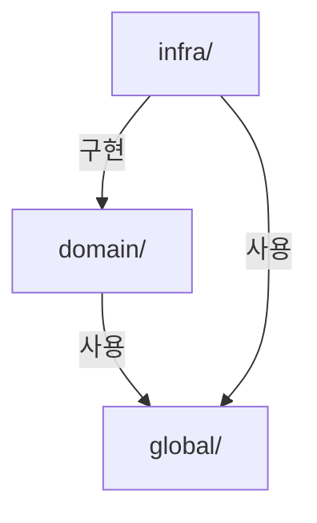

# DraftURL -- 백엔드 설계 (Spring Boot)

> 상태: active
> 작성일: 2026-03-21

---

## 요약

- Spring Boot 3.4.x + Java 21 기반 REST API 서버로, JPA/Hibernate ORM과 Flyway 마이그레이션 사용
- 헥사고날 아키텍처 기반 패키지 구조(domain/infra/global)로 도메인과 인프라를 분리
- R2 파일 저장은 AWS S3 SDK 호환 방식이며, Port-Adapter 패턴으로 교체 용이
- 구조화된 JSON 로깅(Logback) + Sentry 연동으로 운영 가시성 확보

## 하위 문서

| 문서 | 내용 |
|------|------|
| [api.md](api.md) | API 공통 규격, 엔드포인트 목록, 각 API 상세 명세, 에러 코드 총괄 |
| [auth.md](auth.md) | 인증/인가 설계 (OAuth2, JWT, Refresh Token Rotation, Security 필터 체인) |
| [logic.md](logic.md) | 핵심 로직 (문서 생성 2단계 커밋, 서빙, 수정, 삭제, 스케줄러, 상태 전이) |
| [security.md](security.md) | 보안 (입력 검증, HTML 서빙 보안, 인증 보안, HTML 처리 정책, 기술적 리스크) |

---

## 1. 기술 스택

| 구성요소 | 선택 | 이유 |
|---------|------|------|
| 프레임워크 | **Spring Boot 3.4.x** | 안정적인 REST API 서버, Java 생태계 |
| 언어 | **Java 21** | LTS, Virtual Threads 지원, Record 타입 |
| 인증 | **Spring Security 6 + JWT** | OAuth2 Resource Server + 자체 JWT 발급 |
| ORM | **Spring Data JPA + Hibernate** | 성숙한 ORM, 자동 DDL, 쿼리 메서드 |
| AI 연동 | **Anthropic Claude API** | 문서 수정 기능의 핵심 LLM (Phase 2) |
| 빌드 | **Gradle (Kotlin DSL)** | 빠른 빌드, 의존성 관리 |
| API 문서 | **SpringDoc OpenAPI 3** | Swagger UI 자동 생성 |
| 검증 | **Jakarta Validation (Bean Validation)** | 요청 DTO 검증 |
| 스케줄링 | **Spring @Scheduled** | 만료 문서 정리 CRON (외부 엔드포인트 불필요) |
| 마이그레이션 | **Flyway** | DB 스키마 버전 관리 |

> 인프라 선택(DB, R2, 호스팅 등)은 [인프라 설계](../infrastructure/README.md)를 참조한다.

---

## 2. 패키지 구조

도메인별로 controller -> service -> entity/repository 계층을 갖는 구조. 도메인이 외부 레이어에 의존하지 않도록 **인터페이스(Port)를 도메인에 정의하고, 인프라에서 구현**한다. 인증/설정/공통 클래스는 `global`에 모은다.

> **참고**: 실제 코드는 아직 초기 스캐폴딩 단계이며, 아래 3계층(domain/infra/global) 구조가 목표 설계이다. 구현 착수 전 패키지 구조를 이 문서 기준으로 정리한다.

```
src/main/java/com/drafturl/api/
+-- DrafturlApiApplication.java
|
+-- domain/                                    --- 도메인 계층 (비즈니스 로직)
|   +-- document/
|   |   +-- controller/
|   |   |   +-- DocumentController.java        -- 문서 CRUD REST Controller
|   |   +-- service/
|   |   |   +-- DocumentService.java           -- 비즈니스 로직 (FileStorage, ContentSanitizer를 주입)
|   |   |   +-- SlugGenerator.java             -- nanoid 호환 slug 생성 (SecureRandom)
|   |   +-- port/
|   |   |   +-- FileStorage.java               -- interface: 파일 업로드/다운로드/삭제
|   |   |   +-- ContentSanitizer.java          -- interface: HTML 새니타이징
|   |   +-- entity/
|   |   |   +-- Document.java                  -- JPA 엔티티
|   |   +-- repository/
|   |   |   +-- DocumentRepository.java        -- Spring Data JPA
|   |   +-- exception/
|   |   |   +-- DocumentNotFoundException.java
|   |   |   +-- DocumentExpiredException.java
|   |   |   +-- ContentTooLargeException.java
|   |   +-- dto/
|   |       +-- request/
|   |       |   +-- CreateDocumentRequest.java
|   |       |   +-- UpdateDocumentRequest.java
|   |       +-- response/
|   |           +-- DocumentResponse.java
|   |           +-- DocumentListResponse.java
|   |           +-- DocumentViewResponse.java
|   |
|   +-- user/
|   |   +-- controller/
|   |   |   +-- AuthController.java            -- 인증 REST Controller
|   |   +-- service/
|   |   |   +-- AuthService.java               -- 인증 로직 (OAuth2Provider를 주입)
|   |   +-- port/
|   |   |   +-- OAuth2Provider.java            -- interface: 토큰 교환 + 사용자 정보 조회
|   |   +-- entity/
|   |   |   +-- User.java                      -- JPA 엔티티
|   |   |   +-- RefreshToken.java              -- JPA 엔티티
|   |   +-- repository/
|   |   |   +-- UserRepository.java
|   |   |   +-- RefreshTokenRepository.java
|   |   +-- exception/
|   |   |   +-- ForbiddenException.java        -- 소유권 검증 실패
|   |   +-- dto/
|   |       +-- request/
|   |       |   +-- OAuthCallbackRequest.java
|   |       |   +-- RefreshTokenRequest.java
|   |       +-- response/
|   |           +-- AuthResponse.java
|   |           +-- UserResponse.java
|   |
|   +-- storage/
|       +-- service/
|       |   +-- StorageUsageService.java       -- 사용량 추적 로직
|       +-- entity/
|       |   +-- StorageUsage.java              -- JPA 엔티티
|       +-- repository/
|           +-- StorageUsageRepository.java
|
+-- infra/                                     --- 인프라 계층 (도메인 인터페이스 구현 + 외부 의존성)
|   +-- storage/
|   |   +-- R2FileStorage.java                 -- FileStorage 구현 (Cloudflare R2)
|   |   +-- R2Config.java                      -- S3Client 빈 설정
|   +-- sanitizer/
|   |   +-- JsoupContentSanitizer.java         -- ContentSanitizer 구현 (jsoup Safelist)
|   +-- oauth2/
|   |   +-- GoogleOAuth2Provider.java          -- OAuth2Provider 구현 (Google)
|   |   +-- GitHubOAuth2Provider.java          -- OAuth2Provider 구현 (GitHub)
|   |   +-- OAuth2UserInfo.java                -- Provider 공통 사용자 정보 DTO
|   +-- scheduler/
|       +-- DocumentCleanupScheduler.java      -- @Scheduled: 도메인 서비스를 호출만 함
|       +-- PendingCleanupScheduler.java       -- @Scheduled: PENDING 문서 정리
|
+-- global/                                    --- 공유 계층 (인증, 설정, 공통)
    +-- auth/
    |   +-- JwtProvider.java                   -- JWT 생성/검증 유틸
    |   +-- JwtAuthenticationFilter.java       -- OncePerRequestFilter, JWT 인증
    |   +-- UserPrincipal.java                 -- Authentication에 담길 사용자 정보
    +-- config/
    |   +-- SecurityConfig.java                -- Spring Security 설정 (필터 체인, CORS)
    |   +-- JpaConfig.java                     -- JPA Auditing 등 설정
    |   +-- WebConfig.java                     -- 기타 웹 설정
    +-- common/
    |   +-- BaseEntity.java                    -- createdAt, updatedAt 공통 엔티티
    |   +-- ApiResponse.java                   -- 공통 응답 래퍼 {success, data/error}
    |   +-- ErrorResponse.java                 -- 에러 응답 DTO
    +-- exception/
    |   +-- GlobalExceptionHandler.java        -- @RestControllerAdvice (모든 도메인 예외 처리)
    |   +-- BusinessException.java             -- 비즈니스 예외 공통 부모 클래스
    |   +-- RateLimitExceededException.java    -- 도메인 무관, 글로벌 필터에서 발생
    +-- filter/
    |   +-- RateLimitFilter.java               -- Rate Limiting 필터
    +-- enums/
        +-- DocType.java
        +-- DocumentStatus.java
        +-- PlanType.java

src/main/resources/
+-- application.yml                            -- 기본 설정
+-- application-local.yml                      -- 로컬 개발 설정
+-- application-prod.yml                       -- 프로덕션 설정
+-- db/migration/
    +-- V1__init.sql                           -- Flyway 초기 마이그레이션
```

### 계층 간 의존성 규칙

도메인이 외부 레이어에 의존하지 않는 것이 핵심 원칙이다. 도메인은 필요한 기능을 **인터페이스(Port)**로 정의하고, 인프라가 이를 **구현(Adapter)**한다. Spring의 DI가 런타임에 구현체를 주입한다.



| 규칙 | 설명 |
|------|------|
| `domain` ✗-> `infra` | **도메인은 인프라에 의존하지 않는다.** 도메인은 자신이 정의한 인터페이스(Port)만 알고, 구현체를 모른다 |
| `infra` -> `domain` | 인프라가 도메인 인터페이스를 구현한다 (예: `R2FileStorage implements FileStorage`) |
| `domain` -> `global` | 도메인에서 공통 클래스 사용 (예: `BaseEntity`, `BusinessException`) |
| `infra` -> `global` | 인프라에서 설정/공통 클래스 사용 |
| `global` ✗-> `domain`, `infra` | 공유 계층은 어디에도 의존하지 않음 |

### Port-Adapter 매핑

| 도메인 인터페이스 (Port) | 인프라 구현체 (Adapter) | 용도 |
|--------------------------|------------------------|------|
| `document.port.FileStorage` | `infra.storage.R2FileStorage` | 파일 업로드/다운로드/삭제 |
| `document.port.ContentSanitizer` | `infra.sanitizer.JsoupContentSanitizer` | HTML 새니타이징 |
| `user.port.OAuth2Provider` | `infra.oauth2.GoogleOAuth2Provider` | Google OAuth2 |
| `user.port.OAuth2Provider` | `infra.oauth2.GitHubOAuth2Provider` | GitHub OAuth2 |

이 구조의 장점:
- **도메인 테스트가 쉽다**: Port의 mock만 주입하면 외부 의존성 없이 단위 테스트 가능
- **인프라 교체가 자유롭다**: R2 -> S3, jsoup -> 다른 라이브러리로 교체 시 도메인 코드 변경 없음
- **과설계가 아니다**: 인터페이스 + 구현체 1:1 매핑으로 최소한의 간접 레이어. 풀 헥사고날의 Application Service / Use Case 분리까지는 가지 않음

---

## 3. 주요 설정 (application.yml)

환경변수 전체 목록은 [인프라 설계](../infrastructure/README.md)를 참조한다. 여기서는 백엔드 고유 설정만 기록한다.

```yaml
spring:
  jpa:
    hibernate:
      ddl-auto: validate      # Flyway가 DDL 관리, Hibernate는 검증만
    properties:
      hibernate:
        dialect: org.hibernate.dialect.PostgreSQLDialect
  flyway:
    enabled: true
    locations: classpath:db/migration

# JWT 설정
jwt:
  secret: ${JWT_SECRET}
  access-token-expiry: 3600         # 1시간 (초)
  refresh-token-expiry: 604800      # 7일 (초)

# OAuth2 설정
oauth2:
  google:
    client-id: ${GOOGLE_CLIENT_ID}
    client-secret: ${GOOGLE_CLIENT_SECRET}
    token-url: https://oauth2.googleapis.com/token
    user-info-url: https://www.googleapis.com/oauth2/v2/userinfo
  github:
    client-id: ${GITHUB_CLIENT_ID}
    client-secret: ${GITHUB_CLIENT_SECRET}
    token-url: https://github.com/login/oauth/access_token
    user-info-url: https://api.github.com/user

# 서비스 설정
app:
  frontend-url: ${FRONTEND_URL:http://localhost:3000}
  max-content-size: 5242880          # 5MB
  slug-length: 8
  anonymous-expiry-hours: 24
```

---

## 4. 로깅 & 모니터링

### 로그 레벨 지침

| 레벨 | 용도 |
|------|------|
| `ERROR` | 즉시 대응 필요: R2 업로드 실패, DB 연결 실패, 예상치 못한 예외 |
| `WARN` | 주의 필요: Rate limit 초과, 탈취 감지(TOKEN_REUSE_DETECTED), PENDING 정리 실패 |
| `INFO` | 주요 비즈니스 이벤트: 문서 생성/삭제, OAuth2 로그인 성공, 스케줄러 실행 결과 |
| `DEBUG` | 개발/디버깅: 요청/응답 상세, SQL 쿼리, R2 키 경로 |

- 프로덕션 환경에서는 `INFO` 레벨 이상만 출력한다.
- 구조화된 JSON 로깅을 적용하여 검색성을 확보한다 (Logback + `logstash-logback-encoder`).

### Sentry 연동

- `sentry-spring-boot-starter`를 사용하여 Spring Boot에 통합한다.
- `GlobalExceptionHandler`에서 `500` 응답을 반환하는 모든 예외를 Sentry에 자동 전송한다.
- 환경변수 `SENTRY_DSN`으로 프로덕션에서만 활성화한다.
- 민감 정보(JWT, OAuth2 토큰)는 Sentry 이벤트에서 제외하도록 `beforeSend` 콜백을 설정한다.

---

## 5. 설계 결정 및 트레이드오프

> Railway 선택 결정은 [인프라 설계](../infrastructure/README.md)에 기록되어 있다.

### 결정 1: 프론트엔드/백엔드 분리 아키텍처

- **선택**: Next.js (FE) + Spring Boot (BE) 분리
- **대안**: Next.js 풀스택 (API Routes + Server Components)
- **이유**: 백엔드 개발자의 기술 스택(Spring Boot/Java)을 활용하여 생산성 극대화. 백엔드 독립적 스케일링 가능. 향후 모바일 앱 등 다른 클라이언트 추가 시 API 재사용 가능.
- **트레이드오프**: 호스팅 비용 월 $5 증가. 배포 복잡도 증가 (두 개 서비스 관리). 프론트엔드-백엔드 간 네트워크 레이턴시 추가.

### 결정 2: JWT 인증 (NextAuth.js 대체)

- **선택**: Spring Security + 자체 JWT 발급 + OAuth2 클라이언트
- **대안**: NextAuth.js 유지 + Spring Boot에서 세션 검증
- **이유**: 백엔드가 인증의 단일 진실 공급원(Single Source of Truth)이 되어 아키텍처가 깔끔해진다. Next.js는 토큰을 중계하는 역할만 한다.
- **트레이드오프**: OAuth2 콜백 처리를 직접 구현해야 한다 (NextAuth.js의 편의성 상실). 리프레시 토큰 관리를 위한 DB 테이블 추가.

### 결정 4: 문서 타입 변경 불허 (MVP)

- **선택**: PUT 요청에서 `type` 필드를 허용하지 않음
- **대안**: 타입 전환 시 기존 R2 파일 삭제 + 새 키로 업로드
- **이유**: R2 키가 확장자를 포함하므로 타입 변환 시 R2 파일 관리 복잡도 증가. MVP 단순화 우선.
- **Phase 2 검토**: 사용자 피드백에 따라 추가

### 결정 5: sandbox에서 allow-same-origin 제거

- **선택**: `sandbox="allow-scripts"`만 사용
- **대안**: `sandbox="allow-scripts allow-same-origin"` + 서빙 도메인 분리를 MVP에 포함
- **이유**: `allow-scripts` + `allow-same-origin` 조합은 동일 도메인에서 sandbox를 무력화한다. 보안이 LLM HTML 호환성보다 우선.
- **트레이드오프**: `localStorage`, `sessionStorage`, `fetch` with credentials 등 일부 LLM 생성 HTML 기능이 제한됨.

---

## 6. 구현 주의사항

| 항목 | 주의사항 |
|------|----------|
| CORS | 프론트엔드 도메인을 정확히 지정. 와일드카드(`*`) 사용 금지 (credentials 포함 요청과 호환 불가) |
| JWT 비밀키 | 최소 256비트(32바이트) 이상의 안전한 랜덤 값 사용. 환경변수로 관리하고 코드에 하드코딩 금지 |
| nanoid 충돌 | 8자리 nanoid의 충돌 확률은 극히 낮으나, DB INSERT 시 unique constraint 위반 시 최대 3회 재시도 |
| R2 + DB 정합성 | PENDING 상태 도입으로 고아 파일 문제를 완화했으나, 스케줄러가 정상 동작하는지 모니터링 필요 |
| HTML 새니타이징 | jsoup의 `Safelist` 기반 allowlist 방식 새니타이징 사용. `org.jsoup:jsoup` 의존성 추가 |

---

## 관련 문서

- [도메인 모델](../domain.md) -- 엔티티, ERD, DDL, 도메인 규칙
- [프론트엔드 설계](../frontend/README.md) -- 페이지, 컴포넌트, 토큰 관리
- [인프라 설계](../infrastructure/README.md) -- 배포, CI/CD, 환경변수
- [서비스 기능 정의](../../product.md) -- 기능, 플로우, 수익 모델
