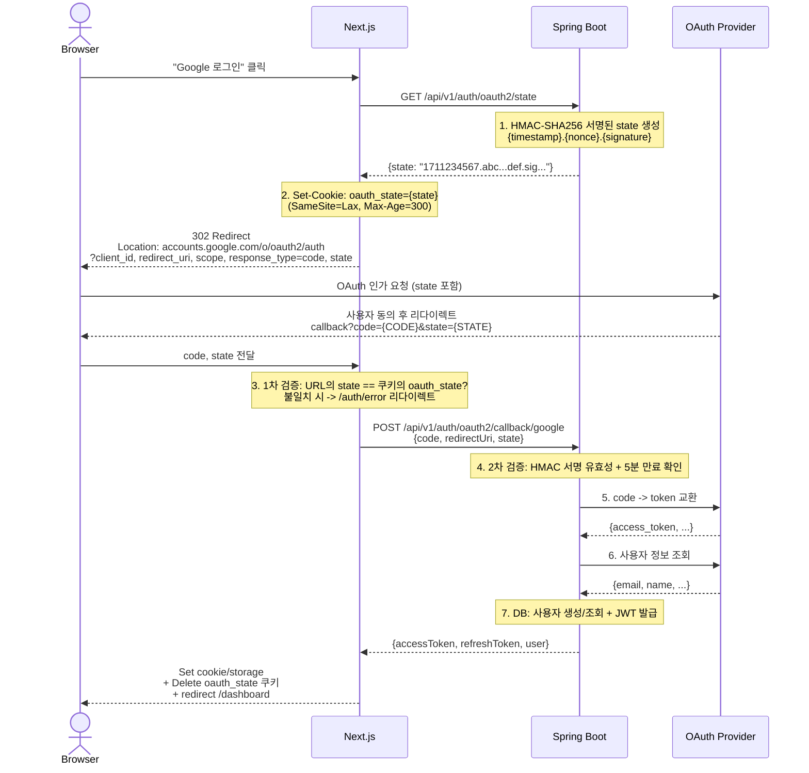
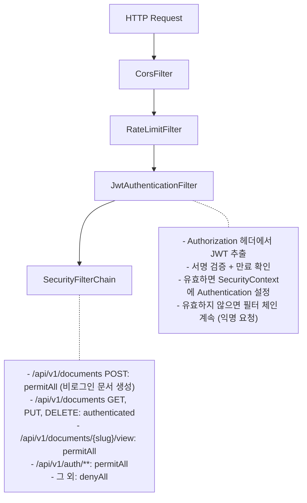

# DraftURL -- 인증/인가 설계

> 상태: active
> 작성일: 2026-03-21

---

## 요약

- OAuth2 소셜 로그인(Google/GitHub)으로 인증하고, Spring Boot가 자체 JWT를 발급하는 구조
- State 파라미터 기반 CSRF 방어와 Refresh Token Rotation으로 토큰 탈취 감지/대응
- JWT(HS256)는 Access Token 1시간, Refresh Token 7일 만료이며, httpOnly 쿠키에 저장
- Spring Security 필터 체인(CORS -> Rate Limit -> JWT -> SecurityFilterChain)으로 요청 처리

---

## 1. 인증 플로우 (OAuth2 + JWT)

### OAuth2 State (CSRF 방어) 흐름

OAuth2 인가 코드 주입(CSRF) 공격을 방어하기 위해 HMAC 서명 기반의 `state` 파라미터로 이중 검증(프론트+백엔드)을 수행한다.

```
[State 생명주기]
1. 로그인 시작 시: Next.js가 Spring Boot에 GET /api/v1/auth/oauth2/state 요청
2. Spring Boot: HMAC-SHA256 서명된 state 생성 (형식: {timestamp}.{nonce}.{signature})
3. Next.js: 응답받은 state를 쿠키 `oauth_state`에 저장 (SameSite=Lax, Max-Age=300)
4. OAuth2 요청: state를 쿼리 파라미터로 포함하여 Provider에 전달
5. 콜백 수신: URL의 state와 쿠키의 state를 Next.js에서 비교 검증 (1차 방어)
6. Spring Boot 전달: 검증 통과 시 code + state를 Spring Boot에 전달
7. Spring Boot 검증: HMAC 서명 유효성 + timestamp 만료(5분) 확인 (2차 방어)
8. 쿠키 삭제: 콜백 처리 완료 후 oauth_state 쿠키 즉시 삭제 (재사용 방지)

[HMAC State 구조]
- payload: {epoch_seconds}.{16byte_random_hex}
- signature: HMAC-SHA256(payload, JWT_SECRET) → Base64URL
- 최종 state: {payload}.{signature}
- 서버 측 저장 불필요 (Stateless 검증)
```



---

## 2. JWT 설계

| 항목 | 값 |
|------|-----|
| 알고리즘 | HS256 (대칭키, MVP 단순화) |
| Access Token 만료 | 1시간 |
| Refresh Token 만료 | 7일 |
| Access Token Payload | `{ sub: userId, email, plan, iat, exp }` |
| Refresh Token 저장 | DB `refresh_tokens` 테이블 (로그아웃 시 무효화 가능) |

Phase 2에서 RS256(비대칭키)으로 전환을 검토한다 (마이크로서비스 확장 시 공개키 배포 필요).

---

## 3. Refresh Token Rotation 흐름

토큰 갱신 시 기존 토큰을 즉시 무효화하고 새 토큰을 발급하는 Rotation을 적용한다.

```
[정상 Rotation 흐름]
1. 클라이언트가 POST /api/v1/auth/refresh 호출 (refreshToken 전달)
2. DB에서 토큰 조회
   - 토큰이 없으면 -> 401 INVALID_TOKEN
   - is_revoked = true이면 -> [탈취 감지 시나리오] 실행
   - expires_at < now이면 -> 401 TOKEN_EXPIRED
3. 기존 Refresh Token: is_revoked = true로 UPDATE
4. 새 Refresh Token 생성 + DB INSERT
5. 새 Access Token 발급
6. 응답: { accessToken, refreshToken, expiresIn }
   (3~4단계는 하나의 @Transactional로 원자 처리)

[탈취 감지 시나리오]
이미 revoked된 토큰으로 갱신 시도가 들어오면, 공격자가 탈취한 토큰을
사용하고 있을 가능성이 높다. 이 경우:
1. 해당 user_id의 모든 Refresh Token을 일괄 무효화 (is_revoked = true)
2. 401 TOKEN_REUSE_DETECTED 에러 반환
3. 클라이언트는 사용자를 로그인 페이지로 리다이렉트
4. 이벤트 로깅 (사용자 ID, 시도 시간, IP 등)

이 방식은 정상 사용자도 재로그인해야 하는 불편함이 있지만,
토큰 탈취 시 피해를 최소화하는 보안 우선 전략이다.
```

RefreshToken 엔티티 상세는 [도메인 모델](../domain.md) 섹션 2를 참조한다.

---

## 4. 프론트엔드 토큰 관리

프론트엔드 토큰 관리 전략은 [client.md](../frontend/client.md) 섹션 3을 참조한다.

---

## 5. Spring Security 필터 체인 구조



---

## 관련 문서

- [API 명세](api.md) -- 인증 API 상세 (요청/응답 포맷, 에러 코드)
- [보안 설계](security.md) -- 인증 보안 위협 및 대응책
- [프론트엔드 클라이언트](../frontend/client.md) -- 토큰 관리, 자동 갱신
- [도메인 모델](../domain.md) -- RefreshToken 엔티티 정의
