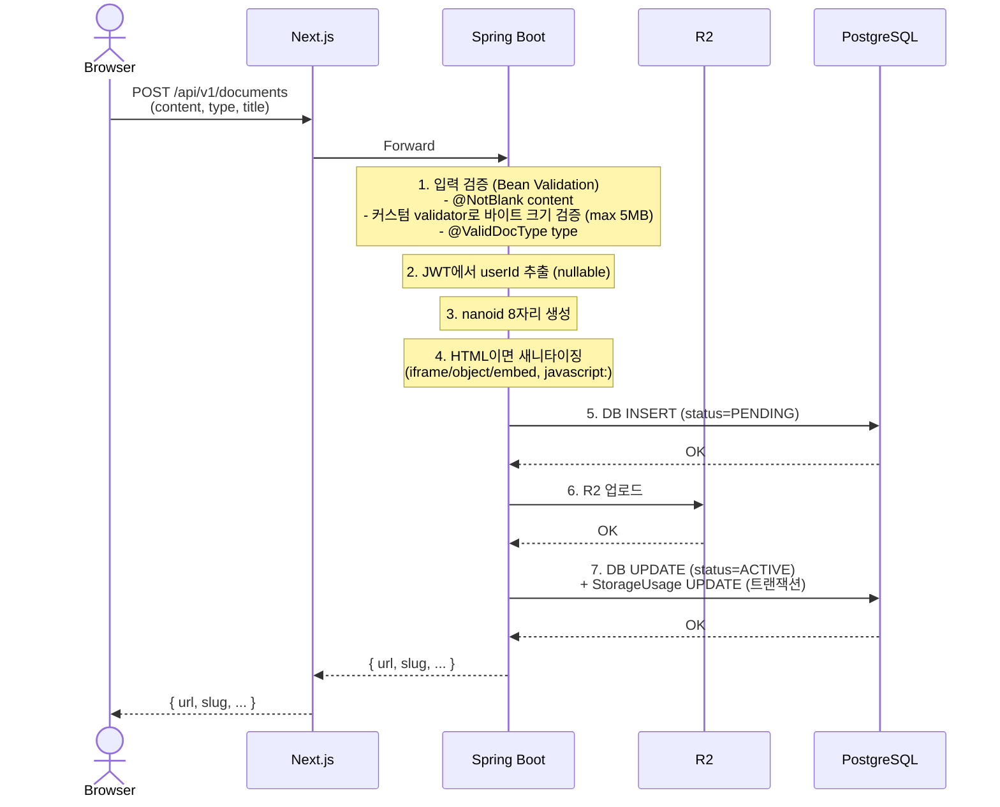
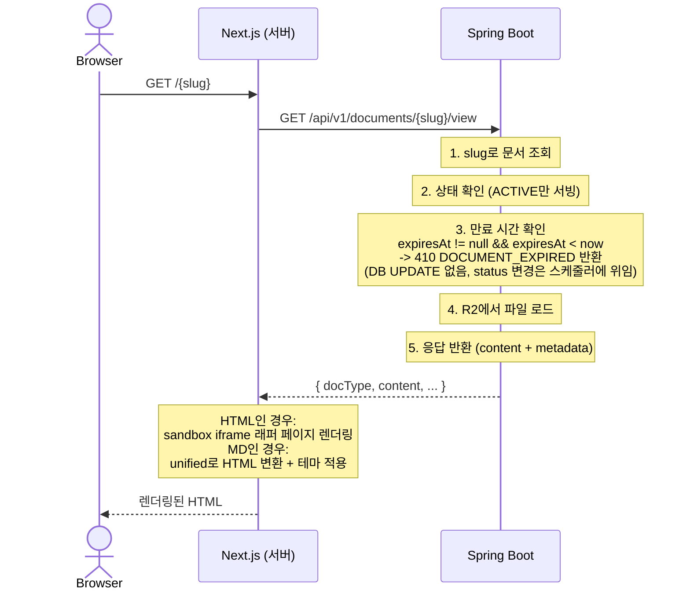
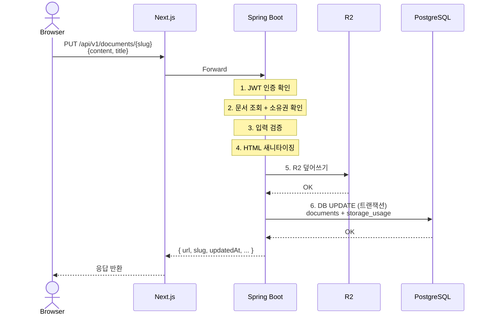
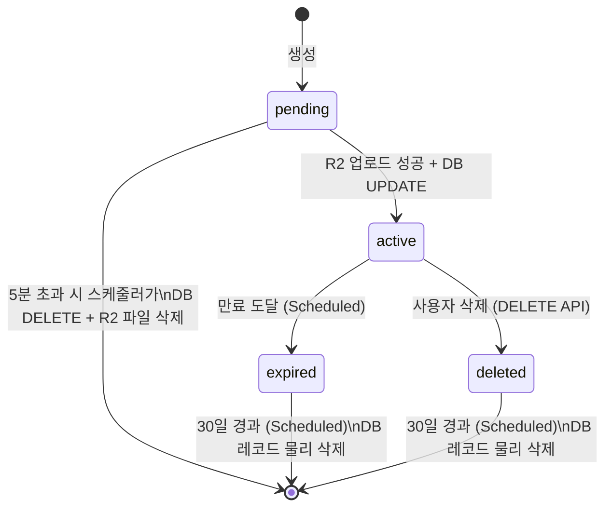

# DraftURL -- 핵심 로직 설계

> 상태: active
> 작성일: 2026-03-21

---

## 요약

- 문서 생성은 2단계 커밋(DB INSERT PENDING -> R2 업로드 -> DB UPDATE ACTIVE) 패턴으로 정합성 확보
- 문서 서빙은 Spring Boot API를 통해 상태/만료 검증 후 R2에서 콘텐츠를 로드하며, sandbox iframe으로 격리 렌더링
- 만료 문서 정리 스케줄러(@Scheduled)가 PENDING 5분 초과, 만료 ACTIVE, 30일 경과 EXPIRED/DELETED를 처리
- 비로그인 문서 소유권 이전은 MVP에서 미지원하며, 상태 전이는 pending->active->expired/deleted 흐름

---

## 1. 문서 생성 (2단계 커밋 패턴)



**실패 처리**:
- 5단계(DB INSERT) 실패: 에러 반환. R2에는 아직 파일이 없으므로 정합성 문제 없음.
- 6단계(R2 업로드) 실패: DB에 `PENDING` 레코드만 존재. 스케줄러가 5분 초과 `PENDING` 문서를 정리.
- 7단계(DB UPDATE) 실패: `PENDING` 상태 유지 + R2에 파일 존재. 스케줄러가 `PENDING` 정리 시 R2 파일도 함께 삭제.

---

## 2. 문서 서빙 (프론트엔드 -> 백엔드)



HTML 서빙 보안 정책(sandbox iframe, CSP 헤더)은 [security.md](security.md) 섹션 5를 참조한다.

---

## 3. 문서 수정



**실패 케이스**:
- 5단계(R2 덮어쓰기) 성공 후 6단계(DB UPDATE) 실패 시: R2에는 새 콘텐츠가 저장되었지만 메타데이터(`contentSize`, `updatedAt`)는 이전 상태. 콘텐츠 자체는 정상 서빙되므로 MVP에서는 허용 가능한 불일치로 간주한다. Phase 2에서 새 R2 키 방식(업로드 -> DB UPDATE -> 이전 파일 삭제)으로 개선 검토.

---

## 4. 문서 삭제

```
1. JWT 인증 + 소유권 확인
2. R2 파일 삭제
3. DB 트랜잭션:
   - documents.status = 'DELETED', updatedAt = now
   - storage_usage: totalBytes 감소, documentCount 감소
4. 응답 반환
```

---

## 5. 만료 문서 정리 (Spring @Scheduled)

Spring의 `@Scheduled`를 사용하므로 외부 HTTP 호출이 불필요하여 인증 문제가 자연스럽게 해결된다. 만료 규칙은 [도메인 모델](../domain.md)의 DR-1, DR-6, DR-9 규칙을 구현한다.

```
@Scheduled(cron = "0 0 * * * *")  // 매시 정각 실행
cleanupExpiredDocuments()
  |
  | 1. PENDING 문서 정리 (5분 초과)
  |    SELECT * FROM documents
  |    WHERE status = 'PENDING'
  |    AND created_at < NOW() - INTERVAL '5 minutes'
  |    LIMIT 100
  |    -> 각 문서: R2 파일 삭제 시도 + DB DELETE
  |
  | 2. 만료 문서 처리
  |    SELECT * FROM documents
  |    WHERE status = 'ACTIVE'
  |    AND expires_at IS NOT NULL
  |    AND expires_at < NOW()
  |    LIMIT 100
  |    -> 각 문서: R2 파일 삭제 + status = 'EXPIRED'
  |
  | 3. 완전 삭제 (30일 이상 EXPIRED/DELETED)
  |    DELETE FROM documents
  |    WHERE status IN ('EXPIRED', 'DELETED')
  |    AND updated_at < NOW() - INTERVAL '30 days'
```

스케줄러 실패 시 Sentry로 알림을 전송한다.

> **스케일 시 참고**: ShedLock + DB 기반 분산 락으로 전환한다 ([인프라 설계](../infrastructure/README.md) 참조).

---

## 6. 비로그인 -> 로그인 시 문서 소유권 이전

MVP에서의 전략: **소유권 이전을 지원하지 않는다.**

근거:
- 비로그인 문서는 24시간 만료이므로 장기 보존 필요성이 낮다.
- 소유권 이전 구현 시 프론트엔드(쿠키/localStorage)와 백엔드(JWT) 양쪽에 걸치는 복잡한 로직 필요.
- 대신 UI에서 "로그인하면 문서가 영구 보존됩니다" 안내를 노출하여 로그인 후 문서를 새로 생성하도록 유도한다.
- 문서 생성 완료 모달에 "비로그인 문서는 대시보드에서 관리되지 않습니다" 안내를 포함한다.

---

## 7. 문서 상태 전이 다이어그램

> [도메인 모델](../domain.md) 섹션 5의 도메인 이벤트와 대응된다.



---

## 8. 트랜잭션 범위

| 작업 | 트랜잭션 범위 | 비고 |
|------|-------------|------|
| 문서 생성 5단계 (DB INSERT) | 단일 트랜잭션 | PENDING 상태로 INSERT |
| 문서 생성 7단계 (DB UPDATE + StorageUsage) | 단일 트랜잭션 | ACTIVE로 전이 + 사용량 업데이트 |
| 문서 수정 6단계 (DB UPDATE + StorageUsage) | 단일 트랜잭션 | 메타데이터 + 사용량 업데이트 |
| 문서 삭제 3단계 (DB UPDATE + StorageUsage) | 단일 트랜잭션 | status=DELETED + 사용량 감소 |
| Refresh Token Rotation | 단일 @Transactional | 기존 토큰 revoke + 새 토큰 INSERT |

---

## 관련 문서

- [API 명세](api.md) -- 각 API의 요청/응답 포맷
- [보안 설계](security.md) -- HTML 서빙 보안, sandbox 정책
- [도메인 모델](../domain.md) -- 도메인 규칙, 상태 전이, 엔티티 정의
- [백엔드 설계 개요](README.md) -- 패키지 구조, 설정
