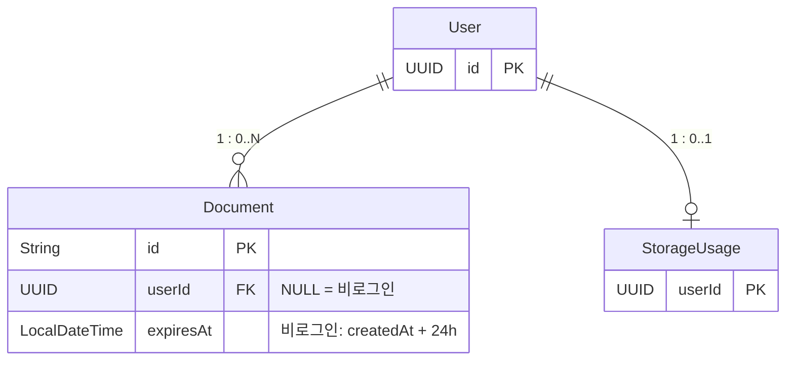

# DraftURL — 도메인 모델 & 데이터 설계

> 상태: active
> 작성일: 2026-03-21

---

## 요약

- User, Document, StorageUsage, RefreshToken 4개 핵심 엔티티와 ERD/DDL(Flyway 마이그레이션) 정의
- Document는 nanoid 8자리를 id이자 slug로 사용하며, R2에 콘텐츠를 저장하는 구조
- 비로그인 24h 만료, 로그인 영구, 5MB 크기 제한 등 10개 도메인 규칙(불변식) 명시
- MVP는 단일 바운디드 컨텍스트로 운영하고, 이벤트 버스 없이 Service 레이어에서 직접 처리

## 1. 바운디드 컨텍스트

MVP에서는 단일 컨텍스트로 운영한다. Spring Boot 내에서 패키지 단위로 모듈을 분리한다.

```
[Document Publishing Context]
  - 문서 생성, 저장, 서빙, 관리의 전체 라이프사이클
  - 사용자 인증은 Spring Security + OAuth2 위임
```

---

## 2. 핵심 엔티티

### User (사용자)

```
User {
  id:             UUID (PK, auto-generated)
  email:          String (unique, not null)
  name:           String (nullable)
  profileImage:   String (nullable)       -- OAuth2 프로필 이미지 URL
  provider:       String (not null)       -- 'google' | 'github'
  providerId:     String (not null)       -- OAuth2 provider의 사용자 ID
  plan:           PlanType                -- 'free' | 'starter' | 'pro'
  createdAt:      LocalDateTime
  updatedAt:      LocalDateTime
}
```

- OAuth2 로그인 전용이므로 password 필드는 없다.
- `provider` + `providerId` 조합으로 소셜 계정을 식별한다.
- `plan` 필드는 MVP에서는 모두 `'free'`로 고정하되, Phase 2 플랜 체계를 위해 미리 포함한다.

### Document (문서)

```
Document {
  id:             String (PK)             -- nanoid 8자리, slug와 동일
  slug:           String (unique)         -- URL 경로, id와 동일 값
  userId:         UUID (FK->User, nullable) -- null = 비로그인 임시 문서
  title:          String (nullable)
  docType:        DocType                 -- 'html' | 'markdown'
  r2Key:          String (not null)       -- R2 저장 경로
  contentSize:    Long (not null)         -- 바이트
  status:         DocumentStatus          -- 'pending' | 'active' | 'expired' | 'deleted'
  expiresAt:      LocalDateTime (nullable) -- 비로그인: 생성 후 24h, 로그인: null
  createdAt:      LocalDateTime
  updatedAt:      LocalDateTime
}
```

- `status`에 `'pending'` 포함: R2 업로드 전 DB에 먼저 INSERT하는 2단계 커밋 패턴 적용.
- `contentSize`를 `Long`(BIGINT)으로 통일하여 `StorageUsage.totalBytes` 집계 시 형변환 불필요.

### StorageUsage (사용량 추적)

```
StorageUsage {
  userId:         UUID (PK, FK->User)
  totalBytes:     Long                    -- 사용자의 총 저장 용량
  documentCount:  Integer                 -- 사용자의 활성 문서 수
  updatedAt:      LocalDateTime
}
```

> **동시성 제어**: `UPDATE storage_usage SET total_bytes = total_bytes + ? WHERE user_id = ?` 형태의 atomic increment로 Race Condition을 방지한다. `documentCount`도 동일한 방식으로 증감한다.

> **documentCount 정확성 주의**: `documentCount`는 여러 경로(생성, 삭제, 스케줄러 만료 처리)에서 증감되는 캐싱 카운터이므로 실제 ACTIVE 문서 수와 불일치할 수 있다. 대시보드의 "사용량" 표시는 `storage_usage` 테이블 대신 `SELECT COUNT(*) FROM documents WHERE user_id = ? AND status = 'active'` 실시간 쿼리로 조회한다 (MVP 규모에서 성능 문제 없음). `storage_usage.document_count`는 내부 제한 검사 등 근사값으로 충분한 용도에 사용하고, 스케줄러의 만료 처리 시에도 로그인 사용자(`user_id IS NOT NULL`)의 문서에 대해 `document_count` 감소를 명시적으로 처리한다.

### RefreshToken (리프레시 토큰)

```
RefreshToken {
  id:             UUID (PK, auto-generated)
  userId:         UUID (FK->User, not null)
  token:          String (unique, not null)    -- 토큰 값
  isRevoked:      Boolean (not null)           -- 폐기 여부
  expiresAt:      LocalDateTime (not null)     -- 만료 시각
  createdAt:      LocalDateTime
}
```

- Refresh Token Rotation 시 기존 토큰을 `isRevoked = true`로 변경하고 새 토큰을 발급한다.
- 탈취 감지(이미 폐기된 토큰으로 갱신 요청) 시 해당 사용자의 모든 토큰을 일괄 무효화한다.
- 상세 Rotation 흐름은 [백엔드 인증 설계](backend/auth.md) 섹션 3 참조.

---

## 3. 값 객체 (Value Objects / Enums)

```java
enum DocType { HTML, MARKDOWN }

enum DocumentStatus { PENDING, ACTIVE, EXPIRED, DELETED }

enum PlanType { FREE, STARTER, PRO }
// Phase 3에서 TEAM 추가 예정

// R2 키 패턴
// documents/{documentId}/content.{ext}
// ext: "html" | "md"
// 예: documents/xK9mP2nQ/content.html

// Slug: nanoid 호환 8자리, URL-safe [A-Za-z0-9]
// 구현: SecureRandom + 커스텀 알파벳으로 직접 구현 (외부 라이브러리 의존 없음)
// JavaScript nanoid(github.com/ai/nanoid)는 Java 라이브러리가 아니므로,
// `com.aventrix.jnanoid:jnanoid` 대신 직접 구현을 선택한다.
// 이유: 단순한 로직(SecureRandom + 문자셋 인덱싱)이므로 외부 의존성 추가 불필요

// FileConstraints
MAX_CONTENT_SIZE = 5 * 1024 * 1024  // 5MB
ALLOWED_DOC_TYPES = [HTML, MARKDOWN]
```

---

## 4. 엔티티 관계



---

## 5. 도메인 이벤트

MVP에서는 이벤트 버스를 구축하지 않고, Service 레이어에서 직접 처리한다. Spring의 `ApplicationEventPublisher`를 사용한 내부 이벤트 발행은 Phase 2에서 도입을 검토한다.

| 이벤트 | 트리거 | 후속 처리 |
|--------|--------|-----------|
| `DocumentCreated` | 문서 생성 완료 (status: active) | StorageUsage 업데이트 |
| `DocumentUpdated` | 문서 내용 수정 | R2 파일 덮어쓰기, StorageUsage 업데이트 |
| `DocumentDeleted` | 문서 삭제 | R2 파일 삭제, StorageUsage 업데이트 |
| `DocumentExpired` | 스케줄러에 의한 만료 처리 | R2 파일 삭제, status = 'expired' |

---

## 6. 도메인 규칙 (불변식)

| 규칙 | 설명 |
|------|------|
| DR-1 | 비로그인 문서는 반드시 `expiresAt`이 설정되어야 한다 (createdAt + 24h) |
| DR-2 | 로그인 사용자의 문서는 `expiresAt`이 null이다 (영구). (Phase 2에서 Free 플랜 7일 만료로 변경 예정, [product.md](../product.md) 참조) |
| DR-3 | 문서 내용(content)의 크기는 5MB를 초과할 수 없다 |
| DR-4 | `docType`은 반드시 `HTML` 또는 `MARKDOWN`이어야 한다 |
| DR-5 | `slug`(= `id`)는 시스템 전체에서 유일해야 한다 |
| DR-6 | `status`가 `EXPIRED`, `DELETED`, `PENDING`인 문서는 서빙하지 않는다 |
| DR-7 | 문서 수정/삭제는 해당 문서의 소유자(userId)만 가능하다 |
| DR-8 | 비로그인 문서는 수정/삭제할 수 없다 |
| DR-9 | `status`가 `PENDING`인 문서는 생성 후 5분 이내에 `ACTIVE`로 전이되지 않으면 스케줄러가 정리한다 |
| DR-10 | Free 플랜 사용자의 활성(ACTIVE) 문서 수는 3개를 초과할 수 없다 (Phase 2에서 구현) |

---

## 7. ERD

```mermaid
erDiagram
    users ||--o{ documents : "1 : 0..N"
    users ||--o| storage_usage : "1 : 0..1"
    users ||--o{ refresh_tokens : "1 : 0..N"

    users {
        UUID id PK
        TEXT email UQ
        TEXT name
        TEXT profile_image
        TEXT provider
        TEXT provider_id
        TEXT plan
        TIMESTAMPTZ created_at
        TIMESTAMPTZ updated_at
    }

    documents {
        TEXT id PK "nanoid 8자리"
        TEXT slug UQ "= id"
        UUID user_id FK "NULL = 비로그인"
        TEXT title
        TEXT doc_type "html | markdown"
        TEXT r2_key
        BIGINT content_size
        TEXT status "pending|active|expired|deleted"
        TIMESTAMPTZ expires_at "비로그인: +24h"
        TIMESTAMPTZ created_at
        TIMESTAMPTZ updated_at
    }

    storage_usage {
        UUID user_id PK_FK
        BIGINT total_bytes
        INTEGER document_count
        TIMESTAMPTZ updated_at
    }

    refresh_tokens {
        UUID id PK
        UUID user_id FK
        TEXT token UQ
        BOOLEAN is_revoked
        TIMESTAMPTZ expires_at
        TIMESTAMPTZ created_at
    }
```

---

## 8. DDL (Flyway 마이그레이션)

```sql
-- V1__init.sql

CREATE TABLE users (
  id              UUID PRIMARY KEY DEFAULT gen_random_uuid(),
  email           TEXT NOT NULL UNIQUE,
  name            TEXT,
  profile_image   TEXT,
  provider        TEXT NOT NULL,
  provider_id     TEXT NOT NULL,
  plan            TEXT NOT NULL DEFAULT 'free',
  created_at      TIMESTAMPTZ NOT NULL DEFAULT NOW(),
  updated_at      TIMESTAMPTZ NOT NULL DEFAULT NOW(),
  UNIQUE (provider, provider_id)
);

CREATE TABLE documents (
  id              TEXT PRIMARY KEY,
  slug            TEXT NOT NULL UNIQUE,
  -- ON DELETE SET NULL: 사용자 삭제 시 user_id가 NULL이 되면 비로그인 문서와 동일하게 취급된다.
  -- 스케줄러가 user_id IS NULL AND expires_at IS NULL인 고아 문서를 감지하여 만료 처리하는 로직을 추가해야 한다.
  user_id         UUID REFERENCES users(id) ON DELETE SET NULL,
  title           TEXT,
  doc_type        TEXT NOT NULL,
  r2_key          TEXT NOT NULL,
  content_size    BIGINT NOT NULL,
  status          TEXT NOT NULL DEFAULT 'pending',
  expires_at      TIMESTAMPTZ,
  created_at      TIMESTAMPTZ NOT NULL DEFAULT NOW(),
  updated_at      TIMESTAMPTZ NOT NULL DEFAULT NOW()
);

CREATE TABLE storage_usage (
  user_id         UUID PRIMARY KEY REFERENCES users(id) ON DELETE CASCADE,
  total_bytes     BIGINT NOT NULL DEFAULT 0,
  document_count  INTEGER NOT NULL DEFAULT 0,
  updated_at      TIMESTAMPTZ NOT NULL DEFAULT NOW()
);

CREATE TABLE refresh_tokens (
  id              UUID PRIMARY KEY DEFAULT gen_random_uuid(),
  user_id         UUID NOT NULL REFERENCES users(id) ON DELETE CASCADE,
  token           TEXT NOT NULL UNIQUE,
  is_revoked      BOOLEAN NOT NULL DEFAULT FALSE,
  expires_at      TIMESTAMPTZ NOT NULL,
  created_at      TIMESTAMPTZ NOT NULL DEFAULT NOW()
);

-- 인덱스
CREATE INDEX idx_documents_user_id ON documents(user_id) WHERE user_id IS NOT NULL;
CREATE INDEX idx_documents_status ON documents(status);
CREATE INDEX idx_documents_expires_at ON documents(expires_at)
  WHERE expires_at IS NOT NULL AND status = 'active';
CREATE INDEX idx_documents_pending_cleanup ON documents(created_at)
  WHERE status = 'pending';
CREATE INDEX idx_documents_user_status_updated ON documents(user_id, status, updated_at DESC)
  WHERE user_id IS NOT NULL;
CREATE INDEX idx_refresh_tokens_user_id ON refresh_tokens(user_id);
CREATE INDEX idx_refresh_tokens_token ON refresh_tokens(token);
```

### 인덱스 용도

| 인덱스 | 용도 |
|--------|------|
| `idx_documents_user_id` | 내 문서 목록 조회 |
| `idx_documents_status` | 상태별 문서 필터링 |
| `idx_documents_expires_at` | 스케줄러 만료 문서 검색 |
| `idx_documents_pending_cleanup` | 스케줄러 PENDING 문서 정리 |
| `idx_documents_user_status_updated` | 대시보드 정렬 조회 최적화 |
| `idx_refresh_tokens_user_id` | 사용자별 리프레시 토큰 조회 |
| `idx_refresh_tokens_token` | 토큰 값으로 조회 |

---

## 9. R2 버킷 구조

### 버킷 구조

```
r2-bucket: drafturl-files
|
+-- documents/
    +-- {document_id}/
    |   +-- content.html          <- HTML 문서
    +-- {document_id}/
    |   +-- content.md            <- Markdown 문서
    +-- ...
```

### 키 네이밍 규칙

```
documents/{document_id}/content.{ext}
```

- `document_id`: nanoid 8자리 (예: `xK9mP2nQ`)
- `ext`: `html` 또는 `md`
- 예시: `documents/xK9mP2nQ/content.html`

### R2 접근 방식

R2 접근 방식, SDK 선택, 접속 설정 등의 상세는 [백엔드 설계](backend/README.md)를 참조한다.

---

## 10. 설계 결정 및 트레이드오프

### 결정: id와 slug 동일 유지 (기존 설계 계승)

- **선택**: nanoid 8자리 = document.id = document.slug
- **대안**: UUID id + 별도 slug, 또는 slug 컬럼 제거
- **이유**: 기존 설계 계승. Phase 2 커스텀 slug 지원 시 slug 컬럼을 업데이트하고 id는 유지.
- **Phase 2 전환 시 고려사항**: 커스텀 slug 도입 시 기존 slug에서 새 slug로의 301 리다이렉트 정책이 필요하다. 코드에서는 항상 id로 내부 식별하고, slug는 URL 노출용으로만 사용한다.

---

## 관련 문서

- [백엔드 설계](backend/README.md) — API 설계, 서비스 로직 (도메인 규칙의 구현)
- [서비스 기능 정의](../product.md) — 만료 정책, 플랜별 제한
