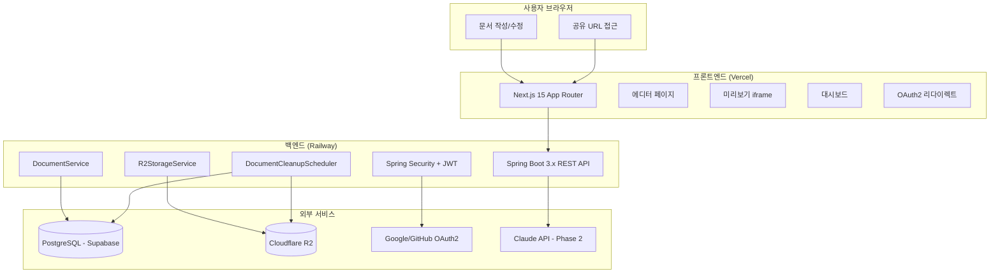

# DraftURL -- 인프라 설계

> 상태: active
> 작성일: 2026-03-21

---

## 요약

- Vercel(FE) + Railway Hobby(BE, $5/월) + Supabase PostgreSQL + Cloudflare R2 구성으로 MVP 월 ~$5 비용
- GitHub Actions CI/CD로 경로별 자동 빌드/배포하며, PR 체크를 머지 필수 조건으로 설정
- 문서 서빙 < 800ms, 문서 생성 < 1.5s 등 성능 목표와 스케일 시 확장 계획 포함
- Sentry(에러 추적) + Vercel Analytics(성능)으로 운영 가시성 확보

## 하위 문서

| 문서 | 내용 |
|------|------|
| [dev-environment.md](dev-environment.md) | 개발 환경 (Docker Compose, 실행 가이드, Cloudflare Tunnel, 로컬 환경변수) |
| [deployment.md](deployment.md) | 배포 아키텍처, CI/CD 워크플로우, Dockerfile, 환경변수 관리, 백엔드 호스팅 비교 |
| [operations.md](operations.md) | 비용 추산 (MVP/스케일), 성능 목표, 캐싱 전략 |

---

## 1. 인프라 기술 스택

| 구성요소 | 선택 | 이유 |
|---------|------|------|
| FE 호스팅 | **Vercel** | Next.js 최적 배포 |
| BE 호스팅 | **Railway Hobby ($5/월)** | 슬립 없이 상시 가동, Spring Boot 콜드 스타트 방지 |
| DB | **Supabase PostgreSQL** | Free/Pro 티어 |
| 파일 저장소 | **Cloudflare R2** | 이그레스 무료, 넉넉한 무료 티어 |
| 도메인 관리 | **Cloudflare DNS** | CDN + DNS 통합 |
| 모니터링 | **Sentry** (에러) + **Vercel Analytics** (성능) | 운영 가시성 |
| CI/CD | **GitHub Actions** | 자동 테스트, 자동 배포 |

---

## 2. 아키텍처 다이어그램

---

## 3. 확장성 계획

| 항목 | MVP | 확장 시 |
|------|-----|---------|
| FE | Vercel (자동 스케일) | 동일 |
| BE | Railway 단일 인스턴스 | Railway Pro (수평 확장) 또는 Fly.io |
| DB | Supabase Free (500MB) | Supabase Pro (8GB+) |
| 파일 스토리지 | R2 (10GB 무료) | R2 (자동 스케일) |
| Rate Limiting | 인메모리 ConcurrentHashMap | Redis (Upstash) |
| 스케줄러 | @Scheduled (단일 인스턴스) | ShedLock + DB 기반 분산 락 |

---

## 4. 설계 결정 및 트레이드오프

### 결정 3: Railway 선택

- **선택**: Railway Hobby ($5/월)
- **대안**: Fly.io Free, Render Free
- **이유**: 슬립 없이 상시 가동. Spring Boot 콜드 스타트(10-15초)로 인한 UX 저하 방지. 간편한 배포/관리.
- **트레이드오프**: 월 $5 비용 발생 (Render Free는 $0이나 15분 비활성 슬립).

> 기타 설계 결정은 각 문서를 참조: [백엔드 설계](../backend/README.md) (FE/BE 분리, JWT 인증, 문서 타입 변경, sandbox 정책), [도메인 모델](../domain.md) (id=slug 결정)

---

## 5. 주의사항

| 항목 | 주의사항 |
|------|----------|
| Spring Boot 콜드 스타트 | Railway에서 상시 가동 설정 확인. 슬립 모드가 활성화되면 첫 요청 시 10-15초 지연 발생 가능 |
| API 버전 | `/api/v1/` 접두사를 사용하여 향후 breaking change 시 `/api/v2/` 병행 가능 |

> FE 관련 주의사항은 [프론트엔드 설계](../frontend/README.md)의 "구현 주의사항" 섹션, BE 관련 주의사항은 [백엔드 설계](../backend/README.md)의 "구현 주의사항" 섹션을 참조한다.

---

## Sources

- [Railway Pricing](https://railway.app/pricing)
- [Fly.io Pricing](https://fly.io/docs/about/pricing/)
- [Render Pricing](https://render.com/pricing)
- [Cloudflare R2 Pricing](https://developers.cloudflare.com/r2/pricing/)
- [Supabase Pricing](https://supabase.com/pricing)

---

## 관련 문서

- [백엔드 설계](../backend/README.md) -- API 설계, 서비스 로직
- [프론트엔드 설계](../frontend/README.md) -- 페이지, 컴포넌트, Vercel 배포
- [도메인 모델](../domain.md) -- DB 스키마, R2 버킷 구조
