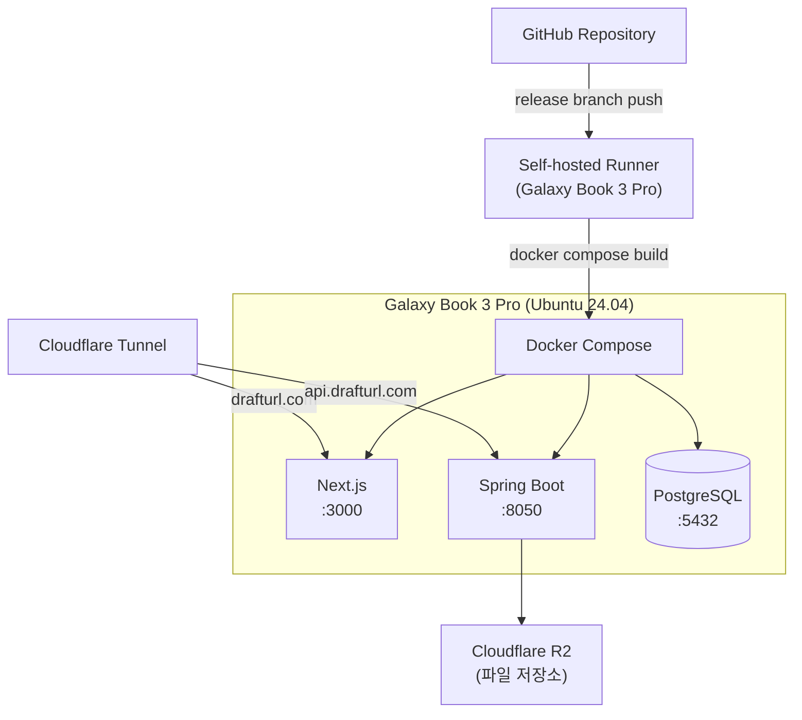

# DraftURL -- 배포

> 상태: active
> 최종 수정일: 2026-03-31

---

## 요약

- 모노레포(frontend/ + backend/)를 Docker Compose로 개발서버에서 직접 운영
- `release` 브랜치 push 시 GitHub Actions Self-hosted Runner가 자동 빌드/배포
- Cloudflare Tunnel로 drafturl.com 도메인을 개발서버에 연결

---

## 1. 배포 아키텍처

---

## 2. 배포 흐름

1. `main` 브랜치에 커밋 + 태그
2. `git push origin main:release` → release 브랜치 push
3. GitHub Actions Self-hosted Runner 트리거
4. Backend: `./gradlew bootJar` → Docker 이미지 빌드 → 컨테이너 재시작
5. Frontend: Docker 이미지 빌드 → 컨테이너 재시작
6. Flyway가 DB 마이그레이션 자동 실행

---

## 3. Docker Compose 구성

| 파일 | 용도 | 포트 |
|------|------|------|
| `docker-compose.yml` | 공유 인프라 (PostgreSQL) | 5432 |
| `docker-compose.dev.yml` | 개발서버 (외부 접근, Tunnel 연결) | BE:8050, FE:3000 |
| `docker-compose.local.yml` | 로컬 테스트용 | BE:8051, FE:3001 |

---

## 4. 환경변수

Backend 환경변수 (docker-compose.dev.yml + .env):

| 변수 | 용도 |
|------|------|
| `SPRING_DATASOURCE_URL` | PostgreSQL 연결 |
| `R2_ENDPOINT` | Cloudflare R2 엔드포인트 |
| `R2_ACCESS_KEY` | R2 인증 |
| `R2_SECRET_KEY` | R2 인증 |
| `R2_BUCKET` | R2 버킷명 |
| `JWT_SECRET` | JWT 서명 비밀키 |
| `APP_CORS_ALLOWED_ORIGINS` | CORS 허용 origin |
| `APP_FRONTEND_URL` | 프론트엔드 URL |
| `APP_MCP_OAUTH2_ISSUER` | MCP OAuth2 issuer URL |
| `RESEND_API_KEY` | Resend 이메일 발송 API 키 |
| OAuth2 시크릿 | Google, GitHub, Naver, Kakao (`.env` 파일에서 주입) |

Frontend 환경변수:

| 변수 | 용도 |
|------|------|
| `INTERNAL_API_URL` | Backend API URL (컨테이너 내부) |

---

## 5. Cloudflare Tunnel

| URL | 연결 대상 |
|-----|-----------|
| `https://drafturl.com` | localhost:3000 (Next.js) |
| `https://api.drafturl.com` | localhost:8050 (Spring Boot) |

상세 설정: [개발 환경](dev-environment.md) 4절 참조.

---

## 관련 문서

- [인프라 설계 개요](README.md) -- 기술 스택, 아키텍처 다이어그램
- [개발 환경](dev-environment.md) -- Docker Compose 환경, Cloudflare Tunnel 설정
- [운영](operations.md) -- 비용 추산, 성능 목표
