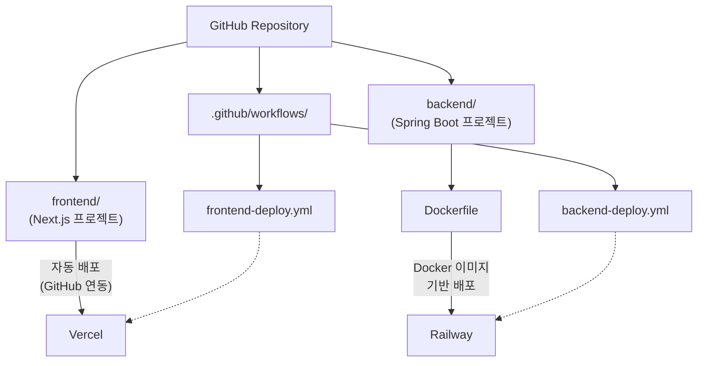

# DraftURL -- 배포

> 상태: active
> 작성일: 2026-03-21

---

## 요약

- 모노레포(frontend/ + backend/)를 GitHub Actions로 경로별 자동 빌드/배포하며, Vercel(FE)과 Railway(BE)에 배포
- PR 체크(빌드+테스트+린트) 통과를 main 브랜치 머지 필수 조건으로 설정
- Spring Boot는 Eclipse Temurin 21 JRE Alpine 기반 Docker 이미지로 Railway에 배포
- 프로덕션 환경변수는 Railway/Vercel UI에서 관리하며, 13종 환경변수를 정의

---

## 1. 배포 아키텍처



모노레포 구조를 사용하여 `frontend/`와 `backend/`를 하나의 저장소에서 관리한다.

---

## 2. CI/CD 워크플로우

| 워크플로우 | 트리거 조건 | 주요 단계 |
|-----------|-------------|----------|
| `backend-deploy.yml` | `main` 브랜치 push, `backend/` 경로 변경 시 | 1. Checkout -> 2. JDK 21 설정 -> 3. Gradle 빌드 + 테스트 -> 4. Docker 이미지 빌드 -> 5. Railway 배포 |
| `frontend-deploy.yml` | `main` 브랜치 push, `frontend/` 경로 변경 시 | 1. Checkout -> 2. Node.js 설정 -> 3. npm ci -> 4. Lint + 타입 체크 -> 5. Vercel 배포 (자동 연동) |
| `pr-check.yml` | Pull Request 생성/업데이트 | 1. BE: Gradle 빌드 + 테스트 -> 2. FE: Lint + 타입 체크 (변경된 경로만 실행) |

- 각 워크플로우에 `paths` 필터를 적용하여 관련 디렉토리 변경 시에만 실행한다.
- PR 체크 통과를 `main` 브랜치 머지의 필수 조건으로 설정한다.

---

## 3. Dockerfile (Spring Boot)

```dockerfile
FROM eclipse-temurin:21-jre-alpine
WORKDIR /app
COPY build/libs/*.jar app.jar
EXPOSE 8080
ENTRYPOINT ["java", "-jar", "app.jar"]
```

CI(GitHub Actions)에서 Gradle 빌드 후 JAR를 생성하고, 이 Dockerfile은 빌드된 JAR만 복사하는 단일 스테이지 구성이다. JDK 21을 사용하며, 빌드 시에도 동일 버전을 사용해야 한다. GitHub Actions에서 `actions/setup-java@v4`로 JDK 21을 설정한다.

---

## 4. 환경변수 관리

| 변수 | 위치 | 용도 |
|------|------|------|
| `DATABASE_URL` | Railway | PostgreSQL 연결 |
| `R2_ENDPOINT` | Railway | Cloudflare R2 엔드포인트 |
| `R2_ACCESS_KEY` | Railway | R2 인증 |
| `R2_SECRET_KEY` | Railway | R2 인증 |
| `R2_BUCKET_NAME` | Railway | R2 버킷명 |
| `JWT_SECRET` | Railway | JWT 서명 비밀키 |
| `GOOGLE_CLIENT_ID` | Railway | Google OAuth2 |
| `GOOGLE_CLIENT_SECRET` | Railway | Google OAuth2 |
| `GITHUB_CLIENT_ID` | Railway | GitHub OAuth2 |
| `GITHUB_CLIENT_SECRET` | Railway | GitHub OAuth2 |
| `FRONTEND_URL` | Railway | CORS 허용 origin |
| `DATABASE_USER` | Railway | PostgreSQL 사용자명 (`DATABASE_URL`에 포함하지 않는 경우) |
| `DATABASE_PASSWORD` | Railway | PostgreSQL 비밀번호 (`DATABASE_URL`에 포함하지 않는 경우) |
| `SENTRY_DSN` | Railway + Vercel | Sentry 에러 추적 |
| `NEXT_PUBLIC_API_URL` | Vercel | Spring Boot API URL |

---

## 5. 백엔드 호스팅 비교

| 항목 | Railway | Fly.io | Render |
|------|---------|--------|--------|
| 최소 비용 | $5/월 (Hobby) | $0 (256MB) ~ $1.94/월 | $0 (무료, 750h/월) |
| Docker 지원 | O | O | O |
| 자동 스케일 | O (Pro) | O | X (Free) |
| DB 내장 | O (PostgreSQL) | O (PostgreSQL) | O (PostgreSQL) |
| 슬립 정책 | 없음 (Hobby+) | 없음 (유료) | 15분 비활성 시 슬립 (Free) |
| Spring Boot 친화성 | 높음 | 높음 | 높음 |

**선택: Railway Hobby ($5/월)**

- 슬립 없이 상시 가동 (Render Free는 15분 비활성 시 슬립으로 콜드 스타트 발생)
- 간편한 Docker/Dockerfile 배포
- 환경변수 관리 UI 우수
- 512MB RAM 기본 제공, Spring Boot에 충분

---

## 관련 문서

- [인프라 설계 개요](README.md) -- 기술 스택, 아키텍처 다이어그램
- [개발 환경](dev-environment.md) -- 로컬 Docker Compose 환경
- [운영](operations.md) -- 비용 추산, 성능 목표
- [백엔드 설계](../backend/README.md) -- application.yml 설정
