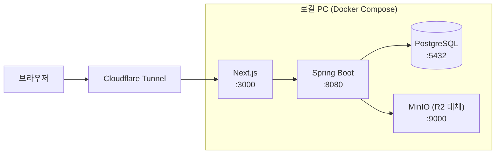
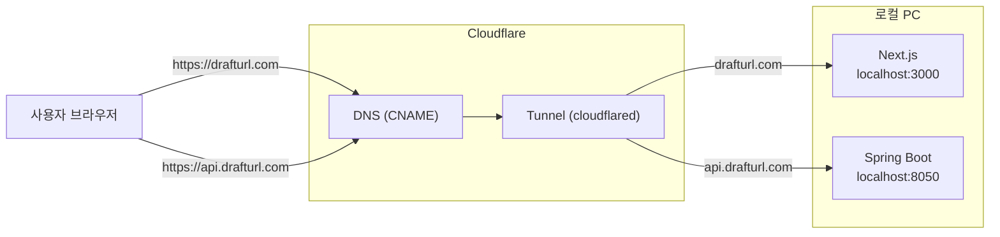

# DraftURL -- 개발 환경

> 상태: active
> 작성일: 2026-03-21

---

## 요약

- Docker Compose로 Next.js, Spring Boot, PostgreSQL, MinIO(R2 대체)를 로컬에서 통합 실행
- Flyway 마이그레이션이 로컬에도 동일하게 적용되어 프로덕션과 스키마 일치
- Cloudflare Tunnel로 로컬 환경을 외부에 노출하여 모바일 테스트, OAuth 콜백 테스트 가능
- 로컬 환경변수(.env.local)로 MinIO, 개발용 JWT 비밀키 등을 설정

---

## 1. 구성

로컬 PC에서 프론트엔드, 백엔드, DB 등 전체 스택을 Docker Compose로 통합 실행한다. 도메인 접근은 Cloudflare Tunnel을 통해 외부에서도 가능하게 한다.



---

## 2. docker-compose.yml 구성

| 서비스 | 이미지 | 포트 | 역할 |
|--------|--------|------|------|
| `frontend` | Node.js (Next.js dev) | 3000 | 프론트엔드 개발 서버 |
| `backend` | Eclipse Temurin 21-jre (Spring Boot) | 8050→8080 | 백엔드 API 서버 |
| `db` | PostgreSQL 15 | 5432 | 로컬 데이터베이스 |
| `storage` | MinIO | 9000, 9001 | R2 대체 (S3 호환 로컬 스토리지) |

- **MinIO**를 Cloudflare R2 대체로 사용. S3 호환 API이므로 코드 변경 없이 동일한 AWS SDK로 접근 가능.
- Spring Boot의 `application-local.yml`에서 MinIO 엔드포인트(`http://storage:9000`)를 사용.
- Flyway 마이그레이션이 로컬 PostgreSQL에도 동일하게 적용되어 프로덕션과 스키마가 일치.
- PostgreSQL 데이터는 Docker 볼륨(`pgdata`)에 영속화하여 컨테이너 재시작 시에도 유지한다.
- MinIO 데이터는 Docker 볼륨(`miniodata`)에 영속화한다.

---

## 3. 실행 가이드

```bash
# 전체 스택 실행 (프로젝트 루트의 docker-compose.yml)
docker compose up -d

# 로그 확인
docker compose logs -f backend

# MinIO 버킷은 백엔드 기동 시 자동 생성됨 (R2Config.ensureBucketExists)
```

---

## 4. Cloudflare Tunnel을 통한 외부 접근 (drafturl.com)

로컬 개발 환경을 `drafturl.com` 도메인으로 외부에 노출하여 모바일 테스트, 팀원 공유, OAuth 콜백 테스트에 활용한다. Cloudflare가 자동으로 SSL 인증서를 제공하므로 별도 HTTPS 설정이 불필요하다.

### 4.1 구조



### 4.2 사전 준비

```bash
# cloudflared 설치 (macOS)
brew install cloudflared

# Cloudflare 계정 인증 (브라우저에서 drafturl.com 도메인 선택)
cloudflared tunnel login
```

### 4.3 터널 생성

```bash
# 터널 생성
cloudflared tunnel create drafturl

# 출력된 터널 ID를 확인 (예: a1b2c3d4-e5f6-7890-abcd-ef1234567890)
# 인증 파일이 ~/.cloudflared/<터널-ID>.json에 자동 생성됨
```

### 4.4 설정 파일 작성

`~/.cloudflared/config.yml`:

```yaml
tunnel: <터널-ID>
credentials-file: /Users/bam/.cloudflared/<터널-ID>.json

ingress:
  # 프론트엔드 (메인 도메인)
  - hostname: drafturl.com
    service: http://localhost:3000
  - hostname: www.drafturl.com
    service: http://localhost:3000

  # 백엔드 API (서브도메인)
  - hostname: api.drafturl.com
    service: http://localhost:8050

  # 필수: catch-all (매칭되지 않는 요청)
  - service: http_status:404
```

### 4.5 DNS 레코드 등록

```bash
# Cloudflare DNS에 CNAME 레코드 자동 생성
cloudflared tunnel route dns drafturl drafturl.com
cloudflared tunnel route dns drafturl www.drafturl.com
cloudflared tunnel route dns drafturl api.drafturl.com
```

### 4.6 환경변수 변경

터널을 통해 접근할 때는 도메인 기반 URL을 사용해야 한다.

**프론트엔드** (`frontend/.env.local`):

```
NEXT_PUBLIC_API_URL=https://api.drafturl.com
```

**백엔드** (`docker-compose.yml` 또는 `application-local.yml`):

```yaml
APP_CORS_ALLOWED_ORIGINS: https://drafturl.com,https://www.drafturl.com
APP_FRONTEND_URL: https://drafturl.com
```

> 로컬 개발 시에는 `NEXT_PUBLIC_API_URL=http://localhost:8050`으로 되돌린다. 터널 사용 시에만 도메인 URL로 변경.

### 4.7 터널 실행

```bash
# 터널 시작 (포그라운드)
cloudflared tunnel run drafturl

# 또는 백그라운드로 실행
cloudflared tunnel run drafturl &
```

실행 후 접근 가능한 URL:

| URL | 연결 대상 |
|-----|-----------|
| `https://drafturl.com` | localhost:3000 (Next.js) |
| `https://www.drafturl.com` | localhost:3000 (Next.js) |
| `https://api.drafturl.com` | localhost:8050 (Spring Boot) |

### 4.8 참고사항

- **SSL**: Cloudflare가 자동으로 SSL 인증서를 발급. `Secure` 쿠키 테스트도 가능.
- **OAuth 콜백**: Google Cloud Console / GitHub OAuth App에서 `https://drafturl.com/auth/callback`을 redirect URI로 등록해야 소셜 로그인 테스트 가능.
- **터널 중지**: `Ctrl+C` 또는 `cloudflared tunnel stop drafturl`. 터널이 중지되면 외부 접근 불가.
- **로컬 전환**: 터널 없이 로컬 개발 시 `frontend/.env.local`의 `NEXT_PUBLIC_API_URL`을 `http://localhost:8050`으로 되돌린다.

---

## 5. 로컬 환경변수 (.env.local)

| 변수 | 값 | 비고 |
|------|-----|------|
| `DATABASE_URL` | `jdbc:postgresql://localhost:5432/drafturl` | 로컬 PostgreSQL |
| `R2_ENDPOINT` | `http://localhost:9000` | MinIO |
| `R2_ACCESS_KEY` | `minioadmin` | MinIO 기본값 |
| `R2_SECRET_KEY` | `minioadmin` | MinIO 기본값 |
| `R2_BUCKET_NAME` | `drafturl-files` | 로컬 버킷 |
| `JWT_SECRET` | `local-dev-secret-key-at-least-32-bytes!!` | 개발용 |
| `FRONTEND_URL` | `http://localhost:3000` | CORS |
| `NEXT_PUBLIC_API_URL` | `http://localhost:8050` | 로컬 API (터널 시 `https://api.drafturl.com`) |

---

## 관련 문서

- [인프라 설계 개요](README.md) -- 기술 스택, 아키텍처 다이어그램
- [배포](deployment.md) -- 프로덕션 환경변수, CI/CD
- [백엔드 설계](../backend/README.md) -- application.yml 설정
